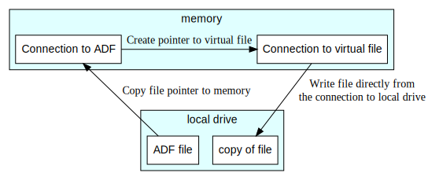

```{r, include = FALSE}
knitr::opts_chunk$set(
  collapse = TRUE,
  comment = "#>"
)
```

## Motivation for adfExplorer2

`adfExplorer2` is the succesor of
[`adfExplorer`](https://pepijn-devries.github.io/adfExplorer). This vignette explains why
a complete overhaul was created and released separately with a different version. It
will also provide some hands on examples showing how to modify your R code when you
are switching from `adfExplorer` to `adfExplorer2`.

In the predecessor `adfExplorer` everything was coded in `R`. Although, technically
a lot could be achieved, it was not very effective. In order to work with Amiga
Disk Files, the entire file first needed to be copied into memory, and than save
the object in memory back to disk after manipulation.

Consider the case where you want to extract a file from a virtual disk and store it
on your local drive. The schematics below show the process in the old situation.
The ADF file first needs to be copied to memory. The file data from that object needs
to be extracted from that copy. After which the file data can be stored to disk:


After working on this approach for a while, I learned about the existence of
[ADFlib](https://github.com/lclevy/ADFlib). This is when I decided to start from scratch
and set up a more efficient design resulting in `adfExplorer2`. There I took the `C`
code from `ADFlib` and build an interface to `R` in `C++`. This strategy had several
advantages:

 * The wheel doesn't have to be reinvented, as `ADFlib` already implemented the
   core functionalities for interacting with Amiga Disk Files.
 * By coding in `C` and `C++`:
    * Custom `R` connections can be created. This allows you to modify the ADF
      files in place without having to copy them to memory first.
    * The program needs to be compiled

Because the new strategy doesn't need to move data back and forth to memory and
uses compiled code, it is much faster (see also the benchmark test below).

Furthermore, you can create connections to files on the virtual device and directly
read from or write to those files. There is no more need to create physical copies of
the virtual file.

The process of extracting a file from an ADF device with `adfExplorer2` would look
something like this:




## Switching to adfExplorer2

When you have code using `adfExplorer`, I recommend switching to `adfExplorer2` at
your earliest convenience. Partly because of the reasons listed above, but also because
`adfExplorer` will receive minimal maintenance. As `adfExplorer2` uses a different
syntax, I have put some examples side by side, to help you translate your code.

Let's start by opening a Amiga Disk File:

```{r opendisk}
adz_file <- system.file("example.adz", package = "adfExplorer2")

# ---------------- adfExplorer
library(adfExplorer)

my_disk1 <- read.adz(adz_file)

# ---------------- adfExplorer2

library(adfExplorer2)

my_disk2 <- connect_adf(adz_file)

```

Show and change the current dir:

```{r curdir}
# ---------------- adfExplorer
current.adf.dir(my_disk1)
current.adf.dir(my_disk1) <- "s"

# ---------------- adfExplorer2
adf_directory(my_disk2)
adf_directory(my_disk2) <- "s"

```

Read from a file on the virtual disk:
```{r fileread}
# ---------------- adfExplorer
get.adf.file(my_disk1, "startup-sequence") |>
  rawToChar()

# ---------------- adfExplorer2
con <- adf_file_con(my_disk2, "startup-sequence")
readLines(con, warn = FALSE)
close(con)
```

Clean up after yourself:

```{r cleanup}
# ---------------- adfExplorer
rm(my_disk1)

# ---------------- adfExplorer2
close(my_disk2)
rm(my_disk2)
```

## Benchmarking adfExplorer and adfExplorer2

A set of tasks were defined to evaluate computational time: open an ADF file;
show the current dir; set the current directory to a specific path; read a small
text file from the virtual device. The plot below shows the time it took to complete
these tasks with both packages. `adfExplorer2` is nearly 5 times faster than its
predecessor.

```{r bench, echo=FALSE}
load(system.file("benchresult.rdata", package = "adfExplorer2"))
pos <-
  barplot(bench_result$bench_mean,
          names.arg = bench_result$test,
          xlab = "package",
          ylab = "benchmark [secs]",
          ylim = c(0, max(bench_result$bench_mean + bench_result$bench_sd)))
with(bench_result, {
  arrows(x0 = c(pos), x1 = c(pos), y0 = bench_mean - bench_sd,
         y1 = bench_mean + bench_sd, angle = 90, code = 3)
})
```